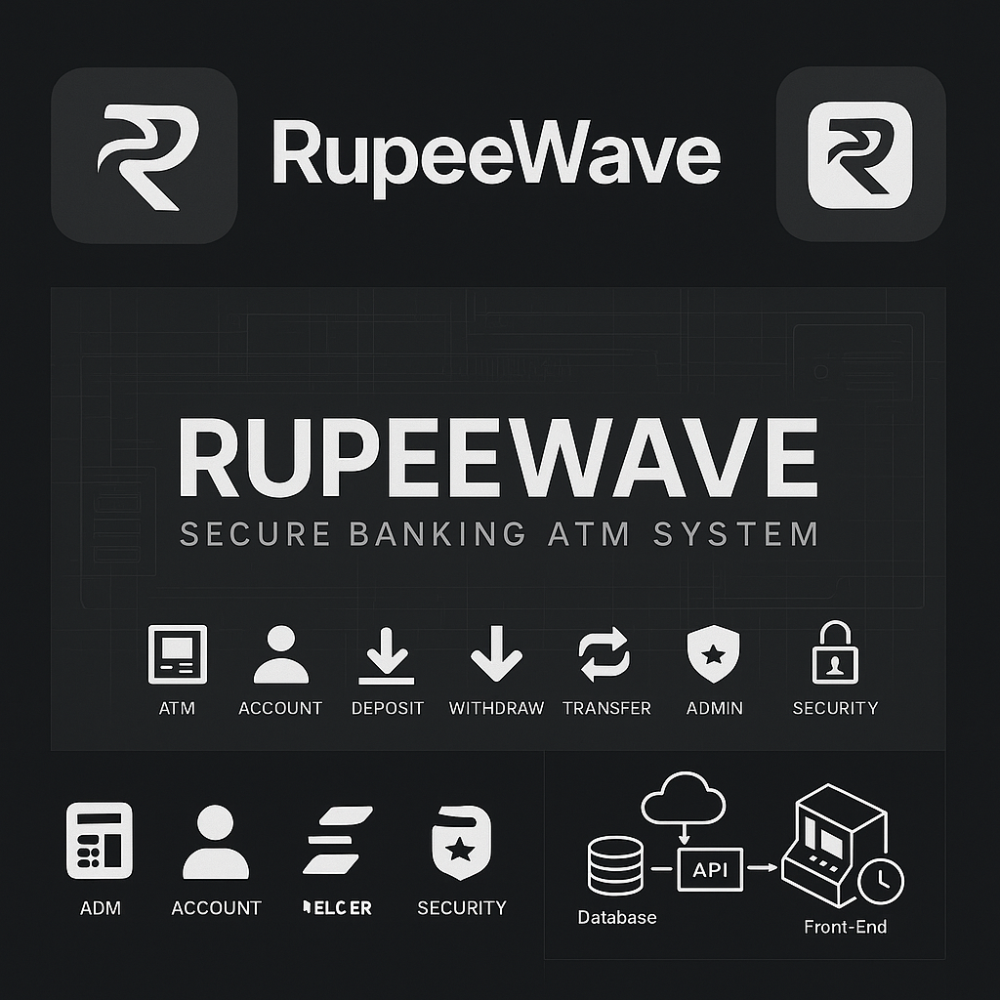

# 📌 **RupeeWave – Secure Banking ATM System**

Modern banking simulation with full authentication, RLS-backed authorization, transaction processing and audit logs built on **FastAPI + Supabase + Next.js**.

<p align="center">
  
</p>

<p align="center">
  
  
  
  
  
  
</p>

---

# 🚀 Live Links

| Component                | URL                                                              |
| ------------------------ | ---------------------------------------------------------------- |
| 🖥️ **Frontend**         | [https://rupeewave.vercel.app](https://rupeewave.vercel.app)     |
| ⚙️ **Backend (Swagger)** | [https://rupeewave.onrender.com](https://rupeewave.onrender.com) |

---

# 🧠 Architecture

```
               ┌───────────────────────────┐
               │         Frontend          │
               │   Next.js + ShadCN UI     │
               │   Sends cookies w/ fetch  │
               └────────────┬──────────────┘
                            │ HttpOnly Cookies
                            ▼
               ┌───────────────────────────┐
               │          Backend          │
               │     FastAPI + JWT         │
               │ Access + Refresh tokens   │
               └────────────┬──────────────┘
                            │ RLS Enforced
                            ▼
               ┌───────────────────────────┐
               │         Supabase          │
               │ Postgres + RLS Policies   │
               │ Audit Logs + RPCs         │
               └───────────────────────────┘
```

---

# 🎯 Features Overview

### 🔐 Authentication

* Admin / Teller login
* JWT Access & Refresh (HttpOnly)
* Auto token refresh
* Bruteforce protection (PIN lockout)
* Full audit logs (IP + User-Agent)

### 🏦 Accounts

* Create new account
* Update mobile/email
* Change PIN
* Balance check

### 💸 Transactions

* Deposit / Withdraw / Transfer
* Atomic RPC functions
* Fully logged

### 📜 History + Audit

* Transaction timeline
* Transfer IN/OUT classification
* Audit logs on admin/teller activity

---

<p align="center">
  
</p>

---

# 📜 Permission Matrix

| Capability                  | Customer | Teller            | Admin |
| --------------------------- | -------- | ----------------- | ----- |
| Create Account              | ❌        | ✅                 | ✅     |
| View Own Balance            | ✅        | ✅                 | ✅     |
| Deposit / Withdraw          | ✅ (self) | ✅ (for customers) | ✅     |
| Transfer                    | ✅ (self) | ✅ (for customers) | ✅     |
| Change PIN / Email / Mobile | ✅ (own)  | ✅ (for customers) | ✅     |
| View All Users              | ❌        | ✅                 | ✅     |
| Create New User             | ❌        | ❌                 | ✅     |
| View Audit Logs             | ❌        | ✅                 | ✅     |
| Delete Users / Accounts     | ❌        | ❌                 | ✅     |
| Manage Roles                | ❌        | ❌                 | ✅     |

---

# 📂 Project Structure

```
RupeeWave/
│
├── Backend/
│   ├── main.py
│   ├── auth/
│   ├── accounts/
│   ├── transactions/
│   ├── tests/
│   └── utils/
│
├── Frontend/
│   ├── app/
│   ├── components/
│   ├── lib/
│   └── hooks/
│
├── README.md
├── LICENSE
└── CONTRIBUTING.md
```

---

# 🖼️ UI Preview


<p align="center">
  
  
</p>

<p align="center">
  
  
</p>

---

# 🛠 Local Setup

### Backend

```bash
yarn install # or pip install -r requirements.txt
uvicorn main:app --reload
```

### Frontend

```bash
npm install
npm run dev
```

---

# 🧪 Tests (Pytest)

```bash
pytest -v
```

Covers:

* User & account creation
* Deposit, withdraw, transfer
* PIN security
* History validation

---

# 🔒 Security Practices

* Cookies are HttpOnly + Secure
* No tokens stored in JS
* RLS policies for all tables
* Auditing for every transaction
* Argument validation at DB + API level

---

# 📈 Future Enhancements

* Customer Portal
* Teller analytics dashboard
* PDF statements
* SMS/Email alerts

---

# 🤝 Contributing

### 1. Fork the repo

### 2. Create your feature branch

```bash
git checkout -b feature/amazing-feature
```

### 3. Commit changes

```bash
git commit -m "Add amazing feature"
```

### 4. Push

```bash
git push origin feature/amazing-feature
```

### 5. Open a Pull Request 🎉

---

# 🐞 Filing Issues

Bug reports should include:

```
Steps to reproduce:
Expected behavior:
Actual behavior:
Environment:
```

Feature requests should include:

```
Use case:
Proposed solution:
Alternatives:
```

---

# 📜 License

MIT License

---

# 🧑‍💻 Author

**Sri Charan Machabhakthuni**
Full-stack engineer | Python backend specialist

---

# ⭐ Support the Project

<p align="center">
  
</p>
